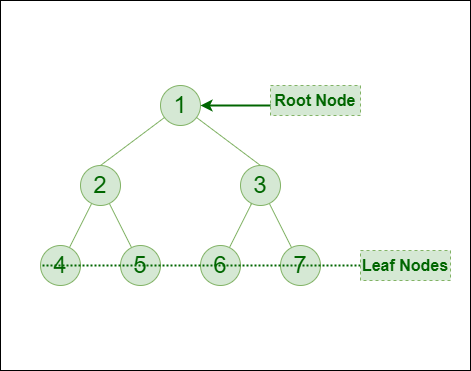
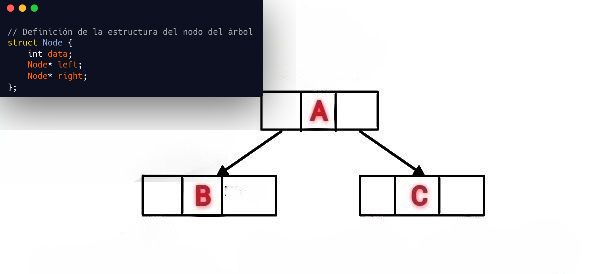
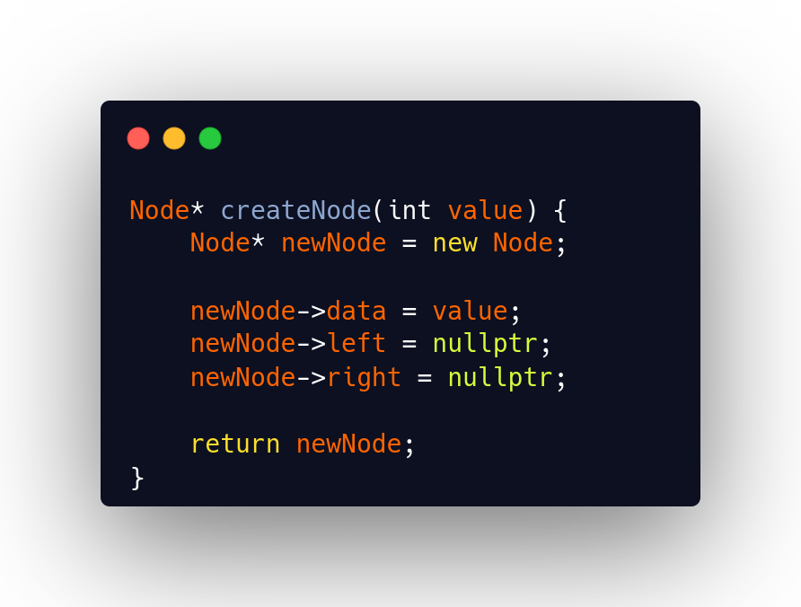
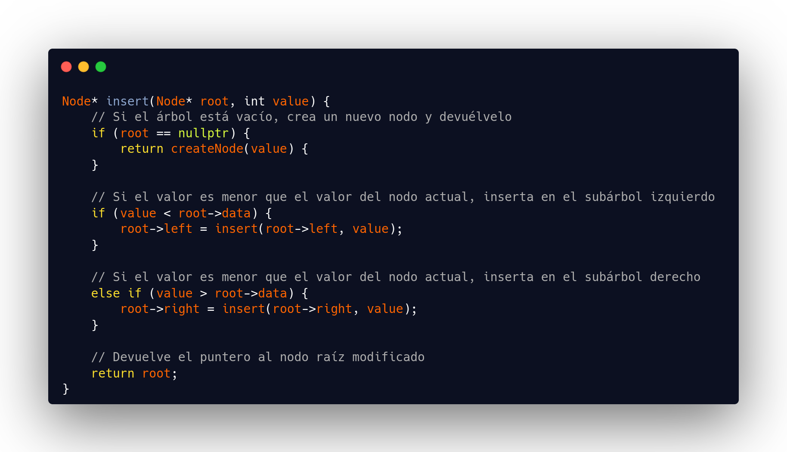
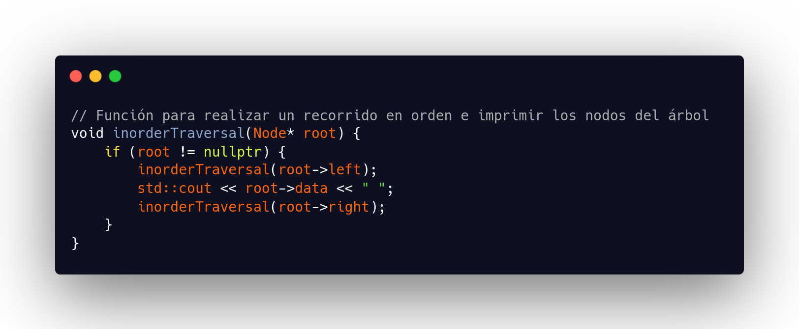
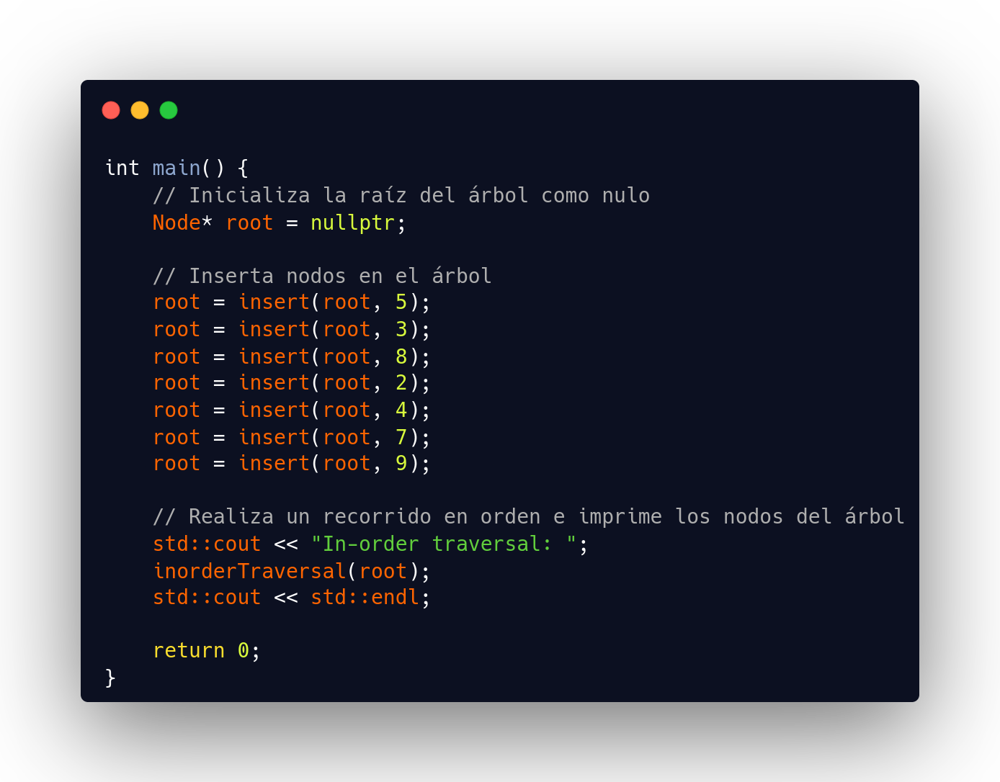

<strong>¡Hola a todos!</strong>

Estoy emocionado de compartir con ustedes una publicación sobre árboles binarios. En este post, exploraremos qué son los árboles binarios, cómo se utilizan en programación y algunas aplicaciones prácticas de esta poderosa estructura de datos. ¡Espero que encuentren esta información útil y emocionante!

<br>
<h1><strong>Introduccion</strong></h1>

Un árbol binario consta de un conjunto finito de elementos. A estos elementos se les denomina nodos, y a cada uno se les asigna un conjunto de líneas dirigidas llamadas ramas, que conectan los elementos formando la imagen característica de un árbol invertido. Del mismo modo, a los elementos en el último nivel del árbol binario se les llama hojas, ya que forman la capa final.

En la siguiente imagen, podemos observar la raíz, que es el nodo 1. Esta raíz tiene dos ramas que se conectan con otros dos nodos: el elemento 2 y el elemento 3. A su vez, estos nodos tienen otra rama que los conecta con otros dos nodos, los cuales son los últimos en la estructura. A estos últimos nodos se les denomina hojas.


*Representación visual de un árbol binario*

<br>
Algunos usos que se les puede dar a un Arbol Binario

* Representan datos jerárquicos de manera eficiente.
* Se utiliza en software de edición como Microsoft Excel y hojas de cálculo.
* Útil para la indexación segmentada en la base de datos es útil en el almacenamiento de caché en el sistema,
* Para implementar colas de prioridad.
* Utilizado para permitir la asignación rápida de memoria en los ordenadores. 
* Los árboles binarios pueden utilizarse para organizar y recuperar información de grandes conjuntos de datos, como en los árboles de índice invertido y k-d.
* Los árboles binarios pueden utilizarse para representar el proceso de toma de decisiones de personajes controlados por ordenador en juegos, como en los árboles de decisión.
* Los árboles binarios pueden utilizarse para implementar algoritmos de ordenación

<br>
<h1><strong>Como funciona un Árbol Binario</strong></h1>

Para comenzar, vamos a crear la estructura básica de un nodo en C++. En este ejemplo, definiremos un tipo de datos Nodo que contendrá un valor entero (dato) y punteros a sus hijos izquierdo (izq) y derecho (der).

<br>

*Representacion visual del fragmento de codigo*

<br>

Bueno ya una vez que tenemos la estrucura basica del nodo raiz, vamos al siguiente paso, el cual es crear un nuevo nodo para nuestro arbol, lo que seria el nivel dos en la imagen representativa anterior.

Para crear una función que cree un nuevo nodo, estableceremos una función de tipo nodo llamada "createNode". Esta función aceptará un parámetro value, que representará el valor del nuevo nodo.

*Fragmento de codigo*

Esta función crea un nuevo nodo con el valor dado. Primero, crea dinámicamente un nuevo nodo utilizando el operador new. Luego, asigna el valor proporcionado al nuevo nodo y establece los punteros left y right en nullptr. Finalmente, devuelve el puntero al nuevo nodo.

 *Fragmento de codigo*

Esta función inserta un nuevo nodo con el valor dado en el árbol. Si el árbol está vacío (es decir, root es nullptr), se crea un nuevo nodo y se devuelve. De lo contrario, se compara el valor con el valor del nodo actual (root). Si es menor, se inserta en el subárbol izquierdo; si es mayor, se inserta en el subárbol derecho. Luego, la función se llama recursivamente en el subárbol correspondiente.


*Fragmento de codigo*

Esta función realiza un recorrido en orden (in-order traversal) del árbol e imprime los valores de los nodos en orden ascendente. Comienza desde el nodo raíz y visita primero el subárbol izquierdo, luego imprime el valor del nodo actual y finalmente visita el subárbol derecho.

*Fragmento de Codigo*

En la función main, creamos un árbol binario insertando varios nodos en él. Luego, realizamos un recorrido en orden del árbol e imprimimos los valores de los nodos en orden ascendente.

Con esto, concluimos la explicación del código del árbol binario. Este enfoque nos proporciona una comprensión básica de la implementación de un árbol binario y establece las bases para explorar variantes más complejas, como el árbol binario transversal (BFS) y el de búsqueda en profundidad (DFS).

Además del árbol binario convencional, es esencial considerar el árbol binario transversal, conocido como BFS (Breadth-First Search) y DFS (Depth-First Search).

BFS se caracteriza por explorar todos los nodos vecinos de un nodo antes de pasar a los nodos del siguiente nivel, siendo útil para encontrar la solución más corta en problemas de búsqueda de rutas o en la verificación de conectividad en grafos.

Por otro lado, DFS se enfoca en explorar tan lejos como sea posible a lo largo de cada rama antes de retroceder, siendo eficaz en la búsqueda de soluciones a problemas como el recorrido de grafos, la generación de laberintos y la determinación de ciclos en grafos dirigidos.

<br>
<h2><strong>Implementación de Árbol Binario en C++</strong></h2>

A continuación, se muestra un ejemplo de cómo implementar un árbol binario en C++. Puedes probar y hacer los cambios que necesites en este código.

```c++
#include <iostream>

struct Node {
    int data;
    Node* left;
    Node* right;
};

Node* createNode(int value) {
    Node* newNode = new Node;
    newNode->data = value;
    newNode->left = nullptr;
    newNode->right = nullptr;
    return newNode;
}

Node* insert(Node* root, int value) {
    if (root == nullptr) {
        return createNode(value);
    }
    if (value < root->data) {
        root->left = insert(root->left, value);
    }
    else if (value > root->data) {
        root->right = insert(root->right, value);
    }
    
    return root;
}

void inorderTraversal(Node* root) {
    if (root != nullptr) {
        inorderTraversal(root->left);
        std::cout << root->data << " ";
        inorderTraversal(root->right);
    }
}

int main() {
    Node* root = nullptr;

    root = insert(root, 5);
    root = insert(root, 3);
    root = insert(root, 8);
    root = insert(root, 2);
    root = insert(root, 4);
    root = insert(root, 7);
    root = insert(root, 9);

    std::cout << "In-order traversal: ";
    inorderTraversal(root);
    std::cout << std::endl;

    return 0;
}
```

<br>
<h1><strong>Conclusion</strong></h1>

En conclusión, los árboles binarios destacan como una estructura de datos versátil y fundamental en numerosas aplicaciones informáticas. Su capacidad para organizar y manipular datos de manera eficiente los posiciona como una herramienta indispensable en el ámbito de la programación y la ciencia de la computación.

Considerados como pilares fundamentales en el vasto universo de la informática, los árboles binarios desempeñan roles críticos, desde la compresión de datos hasta la optimización de algoritmos. Su presencia omnipresente y su capacidad para resolver problemas complejos los convierten en elementos indispensables en el arsenal de cualquier programador o científico de datos.

Con este reconocimiento, nos despedimos, con la certeza de que los árboles binarios continuarán desempeñando un papel vital en la evolución y el progreso de la informática. ¡Hasta pronto en nuestras futuras exploraciones por el vasto mundo digital!

<b> <center> ¡Hasta la próxima publicación! </center> </b>